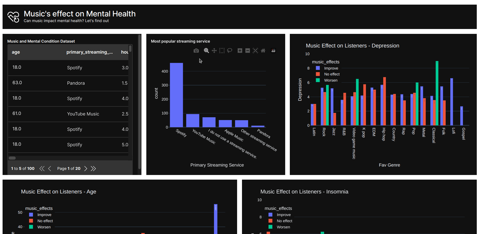

# Effect of Music on Mental Health 

> This project contains the analysis and dashboard of the music and mental health dataset from [Kaggle](https://www.kaggle.com/datasets/catherinerasgaitis/mxmh-survey-results)

## Project Objectives

1. Determine whether music has effect on mental 

2. Collect and clean data using `siuba` and `pandas` 

3. Manipulate the data the R way with `siuba`

4. Visualize the result with `seaborn` and `Plotly`

5. Build a dashboard to tell the story in the data with `h2o_wave`